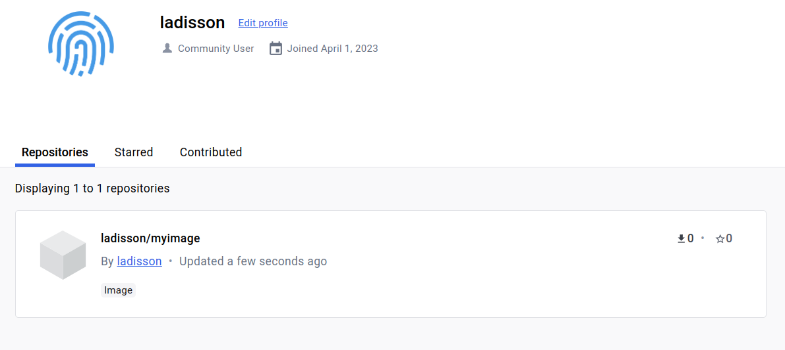

# How to build a docker image.
本项目用于学习使用docker来构建镜像。
这里我们使用docker来编译我们的一个c++项目然后生成一个docker镜像，并将镜像上传到自己的docker仓库，最后使用该镜像来运行我们的项目。

## 0. cpp源文件介绍
在src文件夹下面有一个cpp文件，实现了整数的加法，我们在docker中使用g++编译器来编译这个文件。
```cpp
// add.cpp
#include <iostream>

int main(int argc, char *argv[])
{
    if (argc < 3)
    {
        std::cout << "Usage: " << argv[0] << " <num1> <num2>" << std::endl;
        return 1;
    }
    else
    {
        int num1 = atoi(argv[1]);
        int num2 = atoi(argv[2]);
        std::cout << num1 << " + " << num2 << " = " << num1 + num2
                  << std::endl;
    }
    return 0;
}
```
## 1. 编写Dockerfile
在项目的根目录下创建一个名为Dockerfile的文件。在该文件中，编写构建镜像的指令和参数。
``` dockerfile
# 使用基础镜像
FROM ubuntu:18.04
# 安装g++编译器
RUN apt-get update && apt-get install g++ -y
# 创建一个工作目录
RUN mkdir /myapp
# 复制项目文件到镜像中
COPY ./src /myapp
# 设置docker构建时工作目录
WORKDIR /myapp
# 编译项目
RUN g++ add.cpp -o add && g++ mul.cpp -o mul
# 使用ENTRYPOINT来设置启动命令
ENTRYPOINT [ "/myapp/add" ]
# ENTRYPOINT默认参数，当容器运行输入参数时，会覆盖默认参数
CMD ["2", "3"]
```
## 2. 构建镜像
在项目的根目录下，运行以下命令来构建镜像：
``` shell
docker build -t myimage:v1 .
```
该命令将使用Dockerfile中的指令构建一个新的镜像，并将其标记为"myimage:v1"。
## 3. 运行镜像
一旦镜像构建成功，你就可以运行它了。运行以下命令来启动容器：
```shell
docker run myimage:v1 # 输出 2 + 3 = 5
docker run myimage:v1 5 7 # 输出 5 + 7 = 12
```
该命令将使用"myimage:v1"镜像启动一个新的容器。
## 4. 推送镜像到仓库
如果你想将镜像推送到仓库，例如Docker Hub，你可以使用以下命令：
```shell
docker push username/myimage:v1
# 注: 推送时需要使用docker tag修改image的名字，给image前面加上个人用户名。
# 例如: docker tag myimage:v1 ladisson/myimage:v1 然后就会多出一个image，推送即可
```
该命令将推送"myimage:v1"镜像到"username"用户仓库中。
这样就能在docker hub中看到自己的镜像了。


## 5. 清理镜像
当你不再需要镜像时，可以使用以下命令来清理镜像：
```
docker image prune
```
该命令将删除所有未使用的镜像。
## 总结
在本文中，我们介绍了如何使用Dockerfile构建镜像，并介绍了如何运行和推送镜像到仓库。通过遵循这些步骤，你可以轻松地构建、运行和推送Docker镜像。
项目完整代码，请查看github仓库[地址](https://github.com/LadissonLai/docker-learn)